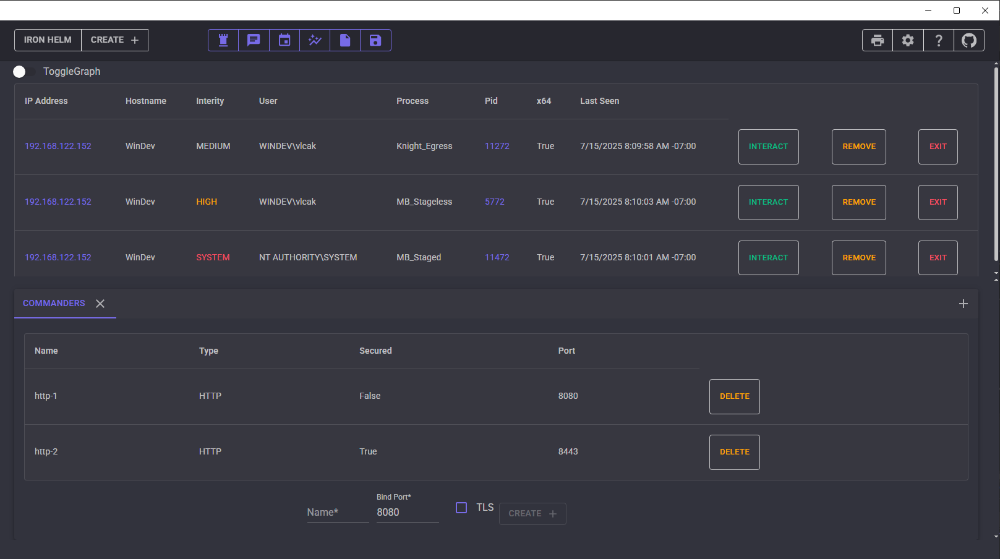
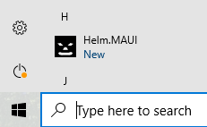
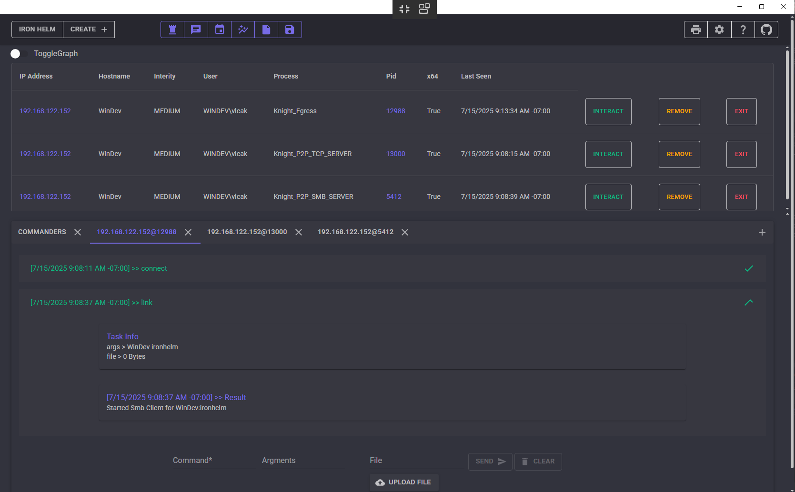
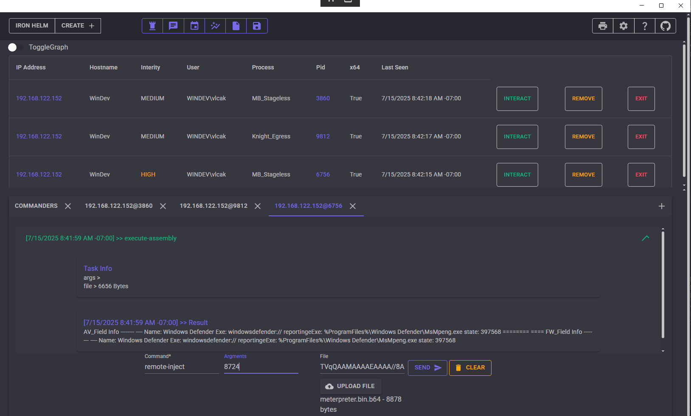
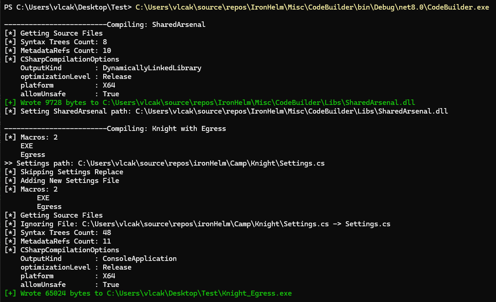

# IronHelm
# Command and Control framework in C# that I made to learn and have fun



# Features
**NOTE:** This project is still under developement
### Castle (teamserver)
- An ASP.NET teamserver
- Data is stsored in a SQLite database
- Manages HTTP listeners with optional TLS certificate
- Can host files and can mange C2Profiles
- Authentication is managed via a JWT token with optional group assignment

### MB (stager)
- C# staged or stageless loader for Knight
- Formats support EXE and DLL with Shellcode via [Donut](https://github.com/TheWover/donut) planned
- Flexible design allowing for different techniques for the following
	- Checks: an optional list of environemt checks (ex. check vm or internet access)
	- Get: method to retrieve payload (ex. http download or read from embedded resource)
	- Format: recover payload (ex. decode or decrypt)
	- Execute: method to execute payload (ex. execute-assembly or injection)
	- CleanUp: an optional method to remove stager (ex. powershell or cmd)

### Knight (implant)
- C# implant that is loaded by MB or built as standalone file
- Formats support EXE and DLL with Exported DLL (C style export that auto loads CLR), Service EXE and Shellcode via [Donut](https://github.com/TheWover/donut) planned
- HTTP, TCP, and SMB comms
- Built in Commands include
	- token manipulation (steal, make, rev2self)
	- shellcode injection (self, remote, and spawn)
	- execute-assembly
 	- powershell and cmd
	- list processes
	- directory manipulation (create and delete)
	- upload and download files
	- connect to tcp/smb listener
	- start local tcp/smb listener
	- sleep change
	- ... with more planned

### SharedArsenal (shared library)
- C# library for Windows API interactions
- Is stamped into Knight and MB (optionally) as embedded resource and loaded at runtime
- Currently supports Kernel32 via P/Invoke but NTDLL, direct/indirect syscalls, api hashing, and dll re-mapping are planned via [DInvoke](https://github.com/TheWover/DInvoke)

### Client
- Available as cross-platform Desktop and Web app
- Built using [Blazor](https://dotnet.microsoft.com/en-us/apps/aspnet/web-apps/blazor) and [MudBlazor](https://www.mudblazor.com/)

# Install
Clone the repo into visual studio and build the solution
### Starting Castle (TeamServer)
Currently only Windows is supported (cross-platform support is planned)

Specify the desired URL for the castle to listen on for Client interaction
- modify `appsettings.json` if in Release mode
- modify `launchSettings.json` if in Debug mode

### Starting Helm (Client)
Modify the `castleAddress` variable with the url of your Castle instance in `Helm.MAUI/MauiProgram.cs`
#### Desktop
To install on the local system you can simply use the deploy function in Visual Studio 
- In Visual Studio, right click the `Helm.MAUI` project and select 'deploy' to install the app on your system.
- It will then be visible in the start menu


To create a distributable app use the publish function
- In Visual Studio, right click the `Helm.MAUI` project and select 'publish'
- Then select [sideload](https://learn.microsoft.com/en-us/windows/application-management/sideload-apps-in-windows) and accept the defaults

#### Web
The web app is built as WASM and can be hosted following this guide [Host and deploy ASP.NET Core Blazor WebAssembly](https://learn.microsoft.com/en-us/aspnet/core/blazor/host-and-deploy/webassembly/?view=aspnetcore-9.0&tabs=windows)

### Building Knights (Agents)
Currently Knights are built using the test project `Misc/CodeBuilder`
- this project will first build a new dll for the `SharedArsenal` project and place it in the `Misc/CodeBuilder/Libs/` folder
- next it will create an egress, tcp server, and smb server instance of the `Knight` project and then a staged and stageless version of the `MB` project
- the configuration of all of these builds are based on the `CodeBuilder/test.yaml` and some hardcoded values
- change the project paths in the `static` variables in the top of `CodeBuilder/Program.cs` to match your system
- next change the macros in the `TempMacros` region to your desired ones in  `CodeBuilder/Program.cs`
- once this project is finished it will be imported into Castle and callable via an API from a Helm

The following files are build
```PS
Knight_Egress.exe
Knight_P2P_SMB_SERVER.exe
Knight_P2P_TCP_SERVER.exe
MB_Staged.exe
MB_Stageless.exe
```


# Project Layout
#### Castle
| IronHelm | Cobalt Strike | About |
| --- | --- | --- |
|  `Castle` | TeamServer | Multi-player server with db|

#### Camp/
| IronHelm | Cobalt Strike | About |
| --- | --- | --- |
|  `Knight` | Beacon | agent with built in capabilities and comms (egress/p2p)  |
|  `MB` (Mounting Block) | Stager | stager with various loading capabilities |
|  `SharedArsenal` | NA | shared library for Windows API interactions |

#### Helms/
| IronHelm |About |
| --- | --- | 
|  `Helm.MAUI` |  client app as Desktop App  |
|  `Helm` |  client app as  Web App |
|  `Helm.Client` |   used by `Helm` |
|  `Helm.Shared` |  shared component library for all Helms |


#### Misc/
| IronHelm |About |
| --- | --- | 
|  `CodeBuilder` | Test project to build projects in `camp/` |
| `ConsoleClientTest` | Test project to test `Castle` API | 


# To Do
- [ ] Finish CodeBuilder + C2Profile and import into castle
- [ ] API for CodeBuilder Service
- [ ] Finish remaining  macro logic
- [ ] Hook up Helm to remaining Castle APIs
- [ ] Enable JWT and Castle tls cert
- [ ] Finish Crypto on comms, MB format, and SharedArsenal resource
- [ ] Bug fixes and Code clean
- [ ] Add more features :)

# Inspiration taken from
- [SharpC2](https://github.com/rasta-mouse/SharpC2)
- [HardHat/CrucibleC2](https://github.com/DragoQCC/CrucibleC2)


# Gallery
### Interaction Examples



### CodeBuilder Example
